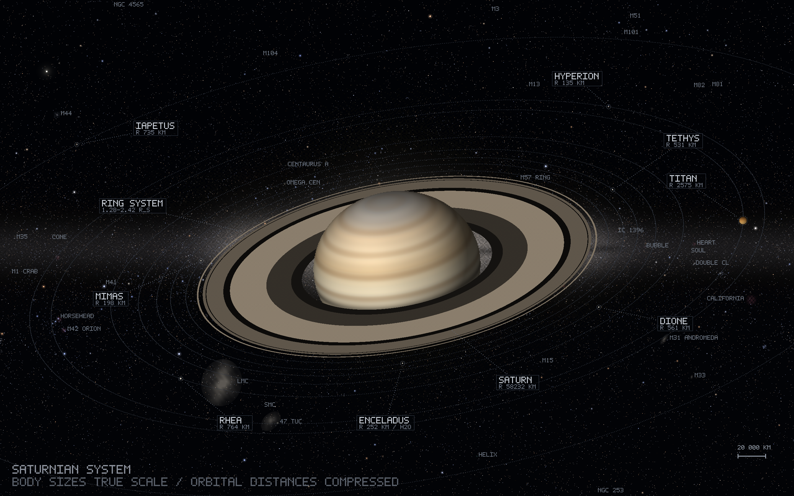

# Saturn System Visualization / 土星系统真实比例可视化



一张 2560×1600 的土星系统壁纸：土星本体、光环与八颗主要卫星按真实相对大小绘制；
背景是程序化生成的**真实星空**——恒星、银河与深空天体全部来自真实星表坐标，
按银道坐标下的 Lambert 圆柱等面积投影铺满全天（银心正好落在土星身后）。

> 不是照片，也不是拼贴：整张图由纯 Python 逐像素渲染（自写 PNG 编码器，无第三方图形库）。

## 特性

- 土星云带采用球面光照模型：由星环椭圆扁率反推视线夹角约 65°，云带弧度与光环投影严格同族
- 光环按 D / C / B / 卡西尼缝 / A / 恩克缝 / F 分区逐像素绘制，"远半环 → 行星 → 近半环"遮挡正确
- 八颗主要卫星按真实半径比例（1 px ≈ 216 km），轨道距离压缩并注明 NOT TO SCALE
- 星空：HYG v4.1 星表 25,791 颗恒星（视星等 ≤ 7.5），颜色按 B−V 色指数映射
- 深空天体：OpenNGC 133 个，另补大、小麦哲伦云（NED 数据）
- 银河：窄分量 + 宽晕 + 核球增亮 − 暗尘带，4px 网格"概率抖动"消除硬边
- 标签系统五层防护：候选位 → 防碰撞 → 保留区 → 障碍回调 → 延迟绘制（标签永远压在轨道线之上）
- 附中文说明文档：[preview/saturn-wallpaper-doc.pdf](preview/saturn-wallpaper-doc.pdf)

## 数据来源

- 恒星：HYG Database v4.1（David Nash）https://github.com/astronexus/HYG-Database
- 深空天体：OpenNGC（Mattia Verga）https://github.com/mattiaverga/OpenNGC
- 大、小麦哲伦云：NASA/IPAC Extragalactic Database (NED)

## 运行

```bash
python3 saturn_true_scale.py     # 输出 2560×1600 PNG
```

`sky_stars.txt` / `sky_objects.txt` 已随仓库附带；也可由 `sky_prep.py` 从两个原始星表 CSV 重新生成。
说明：脚本中的输出路径为作者本机路径，运行前可按需修改。

## 文件说明

| 文件 | 说明 |
|------|------|
| `saturn_true_scale.py` | 主渲染脚本（入口）：土星、光环、卫星、轨道、名牌、合成输出 |
| `sky_render.py` | 天空渲染模块：坐标转换、投影、银河、恒星、深空天体、标签避让 |
| `ascii_arcade_wallpaper.py` | 底层共用：5×7 点阵字模、基础绘图、PNG 编码 |
| `enceladus_jupiter_simple.py` | 底层共用：颜色插值、alpha 混合 |
| `saturn_system_wide.py` | 材质调色板：土卫六 / 土卫八 / 土卫七 |
| `sky_prep.py` | 从 HYG / OpenNGC 提取数据生成两个数据 txt |
| `crop.py` | 局部放大校验工具 |
| `make_doc_pdf.py` | 说明文档 PDF 排版（纯 Python） |
| `flatten_pdf.py` | PDF 整页栅格化（保证任意阅读器显示一致，需 pypdfium2） |
| `宇宙图生成规格.md` | 风格、参数与标签机制规格（复刻 / 改编同类深空图用） |
| `NGC.csv` | OpenNGC 原始星表数据 |
| `hygdata_v41.csv` | HYG v4.1 原始星表（34 MB，超出网页上传限制，见 [Releases](https://github.com/jbr-12/saturn-system-visualization/releases/latest) 附件） |
| `preview/` | 壁纸成品与说明文档 |

## 说明

- 本图是艺术化的科学插图：深空天体外观为示意性绘制，但位置、视大小与方位角均取自星表。
- 代码仅供学习交流使用。
